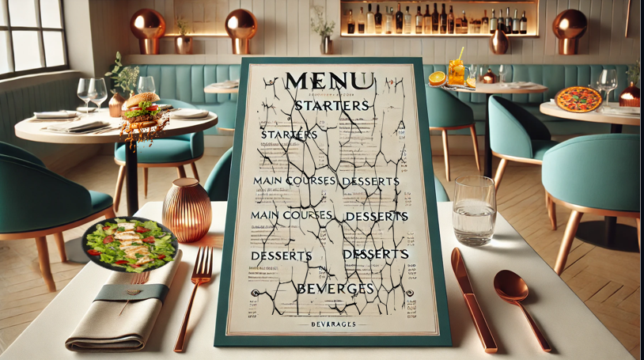
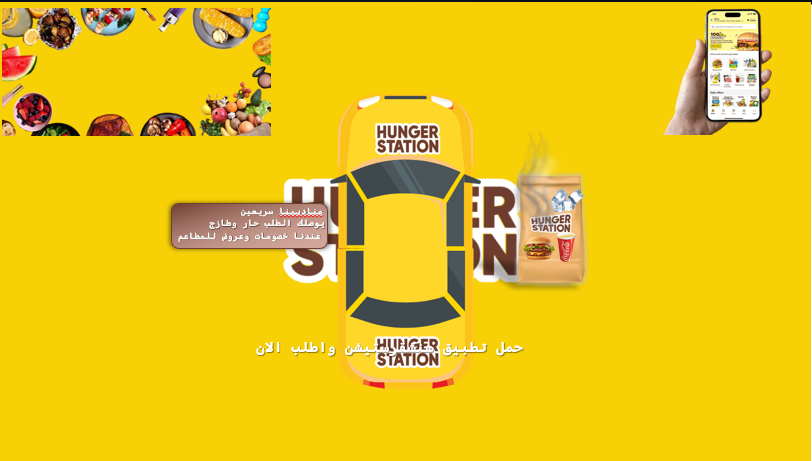
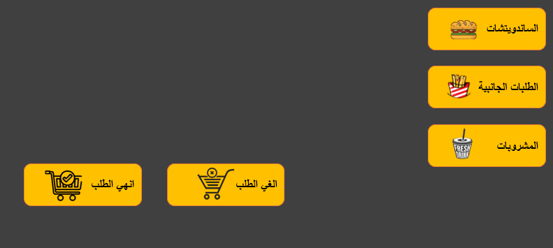

# 🍽️ Smart Restaurant Menu Demo

🎯 **Overview**  
This project presents a smart restaurant concept using two key components:
- A creative PowerPoint presentation to showcase the restaurant's branding, menu design, and customer journey.
- An interactive Excel file that simulates ordering food through a digital menu — including item selection, images, and automatic invoice generation.

---

📁 **Contents**
- `presentation/` → PowerPoint file with the visual pitch
- `interactive-excel/` → Excel file with menu, buttons, and invoice logic
- `images/` → Optional preview images or menu items

---

🛠️ **Tools Used**
- Microsoft PowerPoint
- [PowerPoint Menu ](Restaurant-Menu.pptx)
- [PowerPoint Menu ](Restaurant-Menu.pptx)
- Microsoft Excel (with formulas, conditional formatting, and images)
- [Excel Menu ](Restaurant-Menu.xlsm)

---

📸 **Preview**

 
 

---

📌 **Purpose**
This project is ideal for:
- Restaurant startup presentations
- UI/UX mockups for food apps
- Excel automation demos with real-world use cases

---

💡 **Note**
You can expand this idea further with VBA, Power BI, or even link it to online ordering systems.
